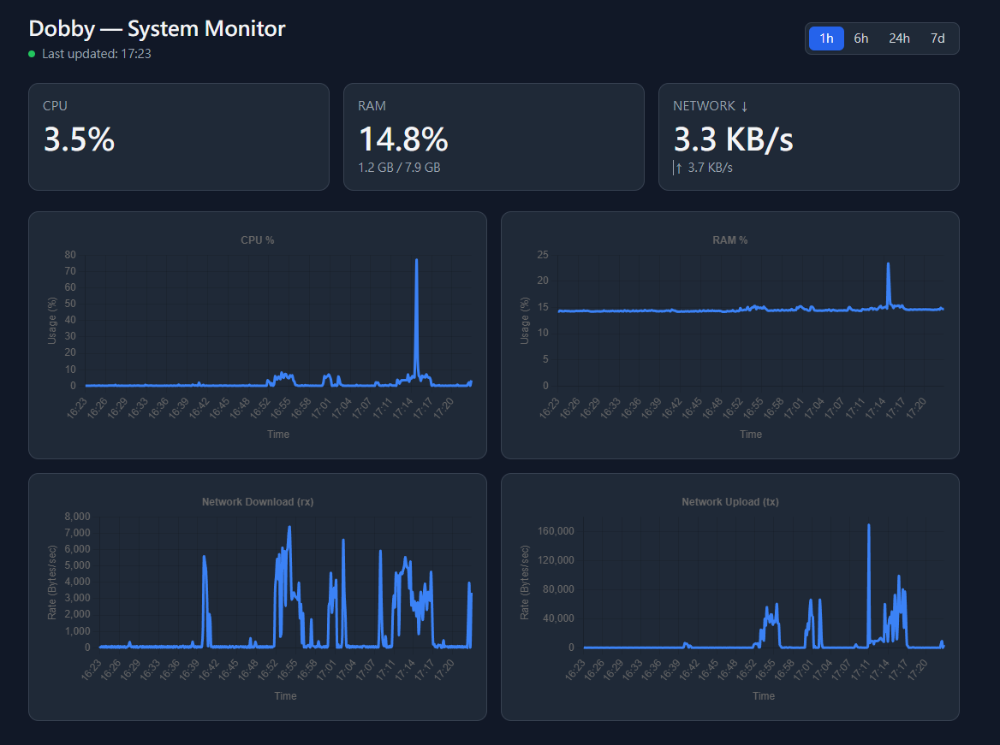

# Dobby — Single-Machine System Monitoring Dashboard

[](https://github.com/DavidNine/Dobby/actions/workflows/ci.yml)

A small personal service that monitors **this machine's** CPU, RAM, and network
usage and shows real-time values plus the last 7 days of trends in the browser
(desktop / phone / tablet on the same LAN).

- **Backend** (`backend/`) — Rust binary: samples metrics every 10s with
  `sysinfo`, stores them in SQLite, and serves a JSON HTTP API (axum + CORS).
- **Frontend** (`frontend/`) — Vite + React + TypeScript + TailwindCSS +
  Chart.js SPA that polls the API every 10s and renders cards + charts.

Scope is fixed: no disk/temperature/process metrics, no auth, no alerting, no
multi-host. (The detailed requirements and architecture docs are kept local and
are not part of this repository.)

## Screenshot



*Live value cards (CPU / RAM / Network) over per-metric history charts with a
`1h / 6h / 24h / 7d` range switch. Each chart is axis-labelled — `Time` on the
x-axis, `Usage (%)` or `Rate (Bytes/sec)` on the y-axis.*

## Features

- **Three core metrics** — overall CPU %, RAM (percent + used/total), and
  network up/down rate, sampled every 10s.
- **Live cards + history charts** — big current-value cards plus Chart.js line
  charts, with selectable ranges (`1h` / `6h` / `24h` / `7d`).
- **7-day retention** — old samples are pruned hourly so the SQLite file stays
  small.
- **Server-side downsampling** — history is averaged into ~360 points per range
  (`1h → 10s`, `6h → 60s`, `24h → 240s`, `7d → 1800s`) for fast, light charts.
- **LAN-friendly & responsive** — binds `0.0.0.0` with CORS enabled; the UI is
  responsive for phones/tablets on the same network.
- **Resilient** — a single failed sample or write is logged and skipped; the
  service keeps running.

## Quick start

Prerequisites: Rust (rustup/cargo) + a C toolchain (gcc), and Node 20+ / npm 9+.

```bash
git clone git@github.com:DavidNine/Dobby.git
cd Dobby

# point the frontend at the backend (edit VITE_API_BASE for LAN access)
cp frontend/.env.example frontend/.env

# build + run both services; Ctrl-C stops both
./start.sh            # add --host to expose the frontend on your LAN
```

Then open <http://localhost:5173>. See [Running the services](#running-the-services)
for per-service commands and configuration.

---

## Cross-Module Conventions (HLD §6 — authoritative)

These are shared verbatim across backend and frontend. Do not diverge.

- **Time**: always **Unix epoch seconds (UTC)** across all modules and the API.
  Timezone formatting happens **only** in the frontend display layer.
- **Network unit**: the API always returns **bytes/sec** (`net_rx_rate_bps` /
  `net_tx_rate_bps`). Conversion to KB/s · MB/s happens **only** in the frontend
  format utilities.
- **`range` strings**: `1h` / `6h` / `24h` / `7d` — used identically by frontend
  and backend (the `?range=` query param on `/api/metrics/history`).
- **Downsampling buckets** (server-side averaging, target ≈360 points):
  `1h → 10s`, `6h → 60s`, `24h → 240s`, `7d → 1800s`.
- **Errors**: backend uses one unified `AppError` enum, mapped to HTTP status
  codes in the API module (invalid `range` → 400; no current data → 204/empty;
  internal error → 500).

### API surface (for reference)

| Method | Path | Notes |
|--------|------|-------|
| GET | `/api/health` | `{ "status": "ok" }` |
| GET | `/api/metrics/current` | latest sample |
| GET | `/api/metrics/history?range=1h\|6h\|24h\|7d` | downsampled series |

---

## Running the services

> All modules are implemented and tested. Start the backend first, then the
> frontend pointed at it via `VITE_API_BASE`.

### Backend

Requires Rust (rustup; cargo 1.96.0) and a C toolchain (gcc) — `rusqlite` uses
the `bundled` feature and compiles its own SQLite, so no system libsqlite is
needed.

```bash
cd backend
cargo build          # compiles all deps incl. bundled SQLite (first build is slow)
cargo run            # runs the binary (scaffold prints a startup message)
cargo test           # runs the backend test suite
```

Backend configuration is via environment variables (defaults shown):

| Env var | Default | Meaning |
|---------|---------|---------|
| `MONITOR_BIND` | `0.0.0.0` | bind address (LAN access) |
| `MONITOR_PORT` | `8080` | API port |
| `MONITOR_SAMPLE_INTERVAL_SECS` | `10` | sampling interval |
| `MONITOR_RETENTION_DAYS` | `7` | history retention |
| `MONITOR_CLEANUP_INTERVAL_SECS` | `3600` | cleanup interval |
| `MONITOR_DB_PATH` | `./monitor.db` | SQLite file path |
| `MONITOR_CORS_ORIGINS` | `*` | allowed CORS origins |

### Frontend

Requires Node 20+ / npm 9+.

```bash
cd frontend
npm install          # first time only
npm run dev          # start the dev server
npm run build        # type-check + production build
npm run test         # run the Vitest suite
```

Frontend configuration via Vite env vars (`.env`, copy from `.env.example`):

| Env var | Default | Meaning |
|---------|---------|---------|
| `VITE_API_BASE` | `http://localhost:8080` | backend API base URL |

> For LAN access from phones/tablets, point `VITE_API_BASE` at the host's LAN IP
> and start the dev server bound to `0.0.0.0` (`npm run dev -- --host`). Do not
> expose this service to the public internet (no auth by design).

---

## Project Structure (HLD §8)

```
.
├── backend/                  ← Rust project (independent service)
│   ├── Cargo.toml
│   └── src/
│       ├── main.rs           ← assembly: load Config, start Sampler + HTTP
│       ├── domain.rs         ← B1 domain types + AppError
│       ├── config.rs         ← B2 config loading
│       ├── collector.rs      ← B3 MetricsCollector (sysinfo)
│       ├── storage.rs        ← B4 MetricsRepository (rusqlite, bundled)
│       ├── sampler.rs         ← B5 background scheduler
│       └── api.rs            ← B6 axum Router + handlers + DTO + CORS
└── frontend/                 ← Vite + React + TS (independent service)
    └── src/
        ├── api/              ← F1 API client + F2 types
        ├── utils/            ← F3 format utils
        ├── hooks/            ← F4 usePolling
        ├── components/       ← F5 UI components
        └── pages/            ← F6 Dashboard
```
